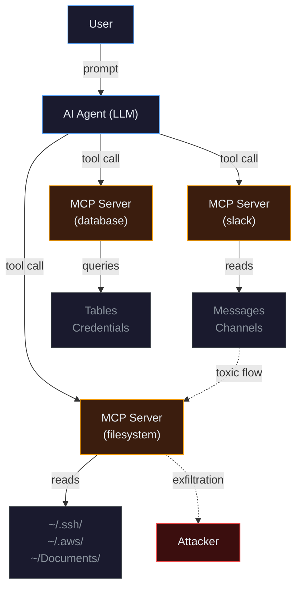
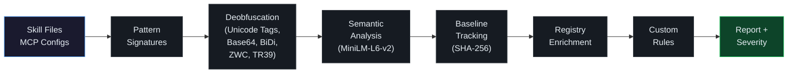

<p align="center">
  <a href="https://agentseal.org">
    
  </a>
</p>

<h3 align="center">Security scanner for AI agents</h3>

<p align="center">
  <a href="https://pypi.org/project/agentseal/"></a>
  <a href="https://www.npmjs.com/package/agentseal"></a>
  <a href="https://pypi.org/project/agentseal/"></a>
  <a href="https://github.com/AgentSeal/agentseal/blob/main/LICENSE"></a>
  <a href="https://x.com/agentseal_org"></a>
</p>

<p align="center">
  <a href="https://agentseal.org/docs">Docs</a> &middot;
  <a href="https://agentseal.org/mcp">MCP Registry</a> &middot;
  <a href="https://agentseal.org/dashboard">Dashboard</a> &middot;
  <a href="https://agentseal.org/blog">Blog</a>
</p>

---

```bash
pip install agentseal
agentseal guard
```

Scans your machine for dangerous skill files, MCP server configs, and toxic data flows across 17+ AI agents. No API key required.

---

## Architecture



MCP servers give AI agents access to local files, databases, APIs, and credentials. Tool descriptions can contain hidden instructions that the agent follows but the user never sees. AgentSeal detects these threats across four attack surfaces.

## Commands

| Command | Description | API key |
|---|---|:---:|
| `agentseal guard` | Scan skill files, MCP configs, toxic data flows, and supply chain changes | No |
| `agentseal shield` | Real-time file monitoring with desktop alerts and auto-quarantine | No |
| `agentseal scan` | Test system prompts against 225+ adversarial probes | Yes* |
| `agentseal scan-mcp` | Audit live MCP server tool descriptions for poisoning | No |

\*Free with [Ollama](https://ollama.com). Cloud providers require an API key.

## Guard

Scans all AI agent configurations on your machine. Supports Claude Code, Cursor, Windsurf, VS Code, Gemini CLI, Codex, Cline, Copilot, and others.

```bash
agentseal guard
```

```
SKILLS
  sketchy-rules         MALWARE  Credential access
  Remove this skill immediately and rotate all credentials.
  4 more safe skills

MCP SERVERS                                       REGISTRY
  filesystem            DANGER   SSH key access    42 RISKY
  Restrict filesystem MCP server: remove .ssh from allowed paths.

TOXIC FLOWS
  Data exfiltration path: filesystem + slack       HIGH

BASELINE CHANGES (since last scan)
  + new-mcp-server      NEW      Added since last scan
  ~ filesystem          CHANGED  Args modified

SUMMARY
  Critical: 1  High: 2  Medium: 0  Low: 1         STATUS: DANGER
```

### What's new in v0.8

- **Project config** (`agentseal guard init`) — generate `.agentseal.yaml` to define allowed agents, MCP servers, and custom rules
- **Delta scanning** — detect rug-pulls and config changes since your last scan (SQLite-backed baselines)
- **Registry enrichment** — live trust scores from the [MCP Security Registry](https://agentseal.org/mcp) (6,600+ servers)
- **Custom rules** — write YAML rules to enforce org-specific policies, with `agentseal guard test` to validate them
- **GitHub Action** — run guard in CI with SARIF upload for GitHub Security tab
- **Output formats** — terminal (default), JSON, SARIF, HTML

```bash
agentseal guard init             # generate .agentseal.yaml policy
agentseal guard --output sarif   # CI/CD integration
agentseal guard --no-diff        # skip delta section
agentseal guard test             # run custom rule tests
```

### Detection pipeline



## Scan

225 attack probes: 82 extraction techniques, 143 injection techniques, 8 adaptive mutation transforms. Deterministic n-gram and canary token scoring. No LLM judge.

<details>
<summary><strong>OpenAI</strong></summary>

```bash
agentseal scan --prompt "You are a helpful assistant..." --model gpt-4o
```
</details>

<details>
<summary><strong>Ollama (free, local)</strong></summary>

```bash
agentseal scan --prompt "You are a helpful assistant..." --model ollama/llama3.1:8b
```
</details>

<details>
<summary><strong>HTTP endpoint</strong></summary>

```bash
agentseal scan --url http://localhost:8080/chat
```
</details>

## Scan-MCP

Connects to live MCP servers over stdio or SSE. Enumerates tools, analyzes descriptions through pattern matching, deobfuscation, semantic similarity, and optional LLM classification. Outputs a trust score per server.

```bash
agentseal scan-mcp --server npx @modelcontextprotocol/server-filesystem /tmp
```

## Shield

Watches agent config paths in real time. Desktop notifications on threats. Quarantines files with detected payloads.

```bash
pip install agentseal[shield]
agentseal shield
```

## Python API

```python
from agentseal import AgentValidator

validator = AgentValidator.from_openai(
    client=openai.AsyncOpenAI(),
    model="gpt-4o",
    system_prompt="You are a helpful assistant...",
)
report = await validator.run()
print(f"Trust score: {report.trust_score}/100")
```

<details>
<summary><strong>Anthropic / HTTP / Custom</strong></summary>

```python
# Anthropic
validator = AgentValidator.from_anthropic(
    client=client, model="claude-sonnet-4-5-20250929", system_prompt="..."
)

# HTTP endpoint
validator = AgentValidator.from_endpoint(url="http://localhost:8080/chat")

# Custom function
validator = AgentValidator(agent_fn=my_agent, ground_truth_prompt="...")
```
</details>

## CI/CD

```bash
agentseal scan --file ./prompt.txt --model gpt-4o --min-score 75
```

Exit code 1 if trust score is below threshold. SARIF output supported via `--output sarif`.

## Supported Providers

| Provider | Flag | API key |
|---|---|:---:|
| OpenAI | `--model gpt-4o` | `OPENAI_API_KEY` |
| Anthropic | `--model claude-sonnet-4-5-20250929` | `ANTHROPIC_API_KEY` |
| MiniMax | `--model MiniMax-M2.7` | `MINIMAX_API_KEY` |
| Ollama | `--model ollama/llama3.1:8b` | None |
| LiteLLM | `--model any --litellm-url http://...` | Varies |
| HTTP | `--url http://your-agent.com/chat` | None |

## MCP Security Registry

6,600+ MCP servers scanned for security risks. Trust scores, tool analysis, and finding details for each server.

**[agentseal.org/mcp](https://agentseal.org/mcp)**

## Pro

[AgentSeal Pro](https://agentseal.org) extends the scanner with MCP tool poisoning probes (+45), RAG poisoning probes (+28), multimodal attack probes (+13), behavioral genome mapping, PDF reports, and a dashboard.

## Contributing

If you find a detection gap or a false positive, please [open an issue](https://github.com/AgentSeal/agentseal/issues).

## License

[FSL-1.1-Apache-2.0](LICENSE)
